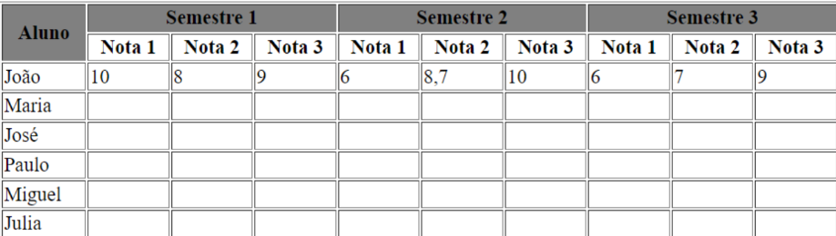

# Aula III (ONLINE) - 08/08/2024
# Prática 1: Criar uma estrutura de tabela que renderize ao final o seguinte resultado:
# 

# Prática 2: Criar uma página HTML para cadastramento de uma pessoa:
# 

# Prática 3: Estruturar a prática 2 com o uso de formulários;
# Deverá disparar no servidor o script: cadastro.php
# Deverá ser enviado por meio do método POST
# Utilizar junto com os elementos:
# Fieldset
# Input SUBMIT e RESET
# UL e LI para organizar os elementos de entrada dedados.